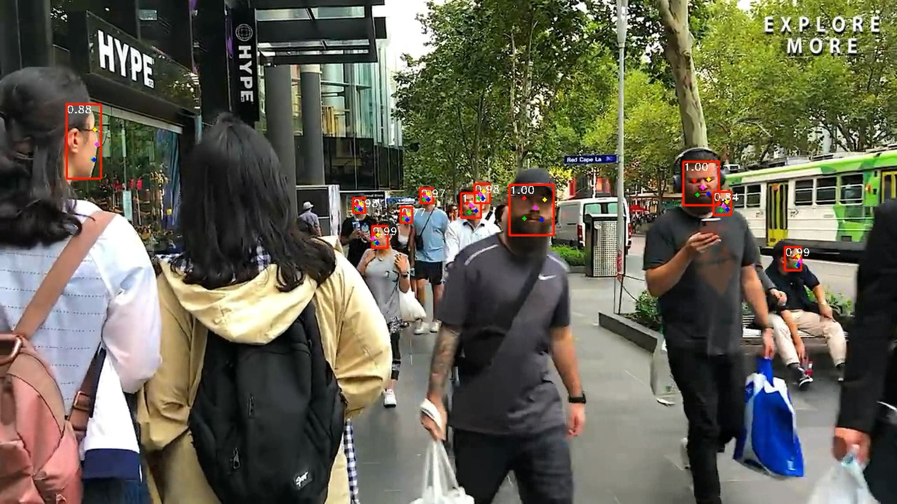

# Running Face Detection in Google Colab

## Original Repository

This repository is a fork from [Pytorch_Retinaface repository](https://github.com/biubug6/Pytorch_Retinaface)
and created to show how you can run your machine learning projects during Qarantine on Google GPU machine if you have no
access to local gpu machine.
-------------

## Requirements

#### Dependencies

| Dependency         | Version        |checked|
|    :---:           | :---           |:---: |
| python             | `= 3.x`        |:white_check_mark:|
| pytorch            |` > 0.21.3`     |:white_check_mark:|
| opencv-python      | `> 3.4`        |:white_check_mark:|
| python-dotenv      | `x`            |:white_check_mark:|

#### Operation System

- Ubuntu 16.04 (we use colab to run our program)

- GPU enabled

- cuda installed 10.1 (9.2 not sure)

#### How to run it

1- Get pretrained weights from [here](https://drive.google.com/drive/folders/1oZRSG0ZegbVkVwUd8wUIQx8W7yfZ_ki1) and 
put it in *./weights/* directory

2- upload the video or image in */upload/* directory

4- run the algorithm using this command

    python  --input < file address > 

            --output-dir < output directory >
            
            --cpu <True/False>  # force cpu computation
            
            --keep_top_k <integer> # How many detection to keep
            
            --confidence_threshold <float between [0-1]> # confidence threshold
            
            --network <resnet50 or mobile0.25> # network for detection of faces
            
            --trained_model <path to trained model>
            
